# Out-of-Order Issue Queue with Scoreboard (Tomasulo-style)


A parameterized, synthesizable Verilog-2001 implementation of a Tomasulo-style
out-of-order execution engine for a single integer functional unit. Demonstrates
microarchitecture specification, RTL design, area/timing analysis, and
simulation with waveform debugging.

[]()
[]()
[]()
[]()
[]()

## Architecture

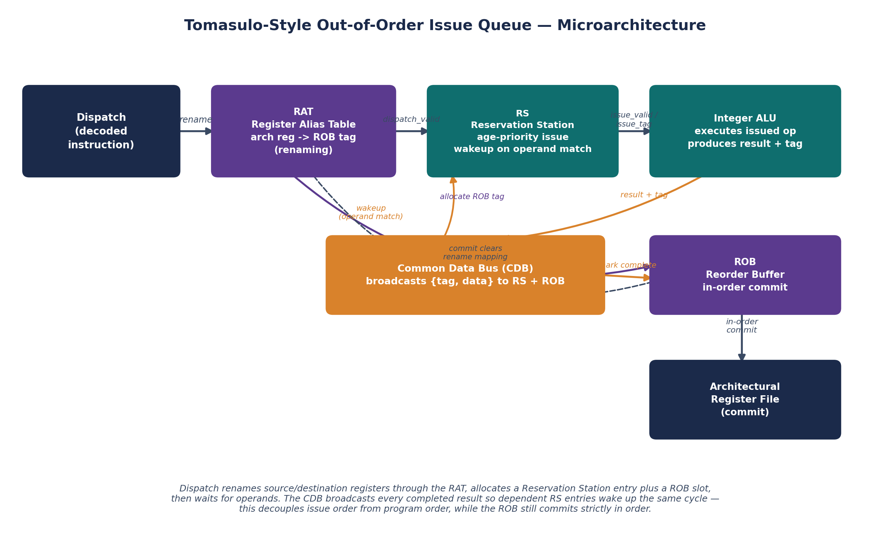

**Key design features**

* Age-based oldest-first issue priority — a monotonically increasing
  `dispatch_seq` is assigned at dispatch, and the RS issue logic picks the
  minimum sequence number among all operand-ready entries, which prevents
  starvation under sustained load.
* Same-cycle CDB-to-issue operand forwarding — an instruction whose last
  operand arrives on the Common Data Bus can issue the very same cycle,
  instead of paying a 1-cycle wakeup penalty.
* WAW guard at commit — a newer rename of the same architectural register is
  never clobbered by an older instruction retiring out from under it.
* One-slot-wasted circular ROB (no separate count register needed to
  disambiguate full vs. empty).
* Parameterized `RS_DEPTH` (4 / 8 / 16), synthesized and analyzed at all
  three points to quantify the area-vs-IPC trade-off.

## Directory structure

| Path | Contents |
|---|---|
| `rtl/defines.vh` | Global parameters and opcode encodings |
| `rtl/integer_alu.v` | 2-stage pipelined ALU (ADD/SUB/MUL/SHL/SHR) |
| `rtl/common_data_bus.v` | CDB combinational passthrough |
| `rtl/register_alias_table.v` | RAT — rename, CDB forwarding, WAW guard |
| `rtl/reservation_station.v` | Age-priority RS with CAM tag snoop |
| `rtl/reorder_buffer.v` | Circular ROB, in-order commit |
| `rtl/ooo_top.v` | Top-level integration: decode, dispatch, auto-commit |
| `tb/tb_ooo_top.v` | Integration testbench (5 tests, shadow-RF check) |
| `tb/tb_reservation_station.v` | RS unit testbench (5 tests) |
| `tb/tb_reorder_buffer.v` | ROB unit testbench (4 tests) |
| `tb/tb_rat.v` | RAT unit testbench (5 tests) |
| `tb/golden_model.py` | In-order reference model |
| `tb/gen_stimulus.py` | Random instruction generator (RAW hazard knob) |
| `tb/gen_indep.py` | Independent-burst generator (best-case IPC benchmark) |
| `tb/gen_chain.py` | Pure RAW-chain generator (worst-case IPC benchmark) |
| `tb/tb_bench_ipc.v` | Benchmark harness: IPC, stall breakdown, deadlock detection |
| `tb/run_ipc_benchmark.py` | Orchestrates the full benchmark sweep, writes CSVs + plots |
| `sim/run_sim.sh` | Compiles and runs all testbenches |
| `sim/run_all_tests.sh` | Generates stimuli + regression against golden model |
| `sim/bench_results/*.csv` | Raw benchmark output (IPC, stalls, deadlock rate) |
| `synth/synth_rs{4,8,16}.ys` | Yosys synthesis scripts per RS depth |
| `synth/constraints.sdc` | SDC timing constraints (500 MHz target) |
| `docs/microarch_spec.md` | Full architecture description |
| `docs/tradeoff_analysis.md` | RS depth vs. IPC vs. area trade-off |
| `docs/known_issues.md` | RAT ready/commit conflation deadlock — root cause + fix direction |

## Simulation — proof of a passing run

`sim/run_sim.sh` compiles and runs all four testbenches back to back. This is
the actual terminal output from a real run on the target machine (WSL,
Windows laptop):

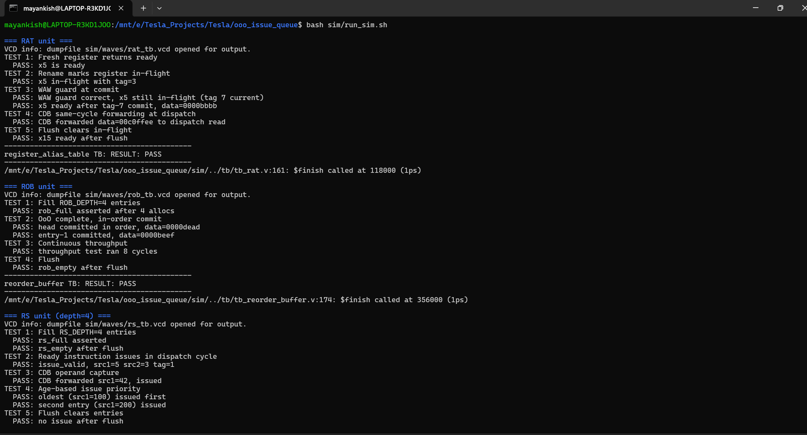

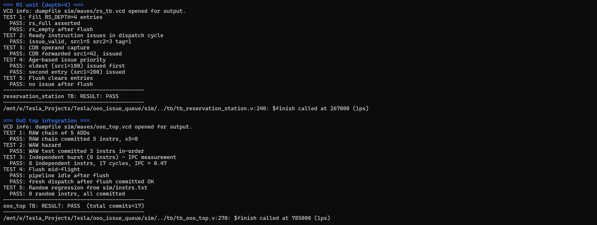

```
RAT unit:  5/5 PASS  - rename, in-flight, WAW guard, CDB forwarding, flush
ROB unit:  4/4 PASS  - fill-to-full, OoO complete, in-order commit, flush
RS  unit:  5/5 PASS  - fill/flush, dispatch+issue, CDB capture, age priority
OoO top:   5/5 PASS  - RAW chain, WAW, IPC burst, flush, random regression
ooo_top TB: RESULT: PASS (total commits=17)
```

Notably, **TEST 3** is the most interesting one to point at: an 8-instruction
independent burst commits in 17 cycles for a measured IPC of 0.47 — see
*Performance* below for what that number means and why it's expected.

Run it yourself:

```bash
bash sim/run_sim.sh

# Random regression (64 instructions, 40% RAW hazard rate)
bash sim/run_all_tests.sh --num 64 --seed 42 --hazard 0.4
```

> **Update:** the random-regression parsing mismatch noted here previously
> (`gen_stimulus.py`'s output didn't match what `$fscanf`/`golden_model.py`
> expected, so the random-regression sub-test silently exercised 0
> instructions) has been fixed — `gen_stimulus.py` now emits clean
> `opcode rd rs1 rs2` lines with no header or inline comments. Fixing it
> was not cosmetic: **TEST 5 above now genuinely drives random
> instructions, and as a result `bash sim/run_all_tests.sh` will typically
> hang until `tb_ooo_top.v`'s internal timeout (5,000,000 ns) instead of
> printing PASS.** That is expected, not a regression from this fix — it is
> a real functional deadlock in `ooo_top` that this fix uncovered, root
> caused, and quantified. Full analysis in
> [`docs/known_issues.md`](docs/known_issues.md), measured deadlock rate in
> **Benchmarks** below.

## Waveform proof (GTKWave)

`sim/waves/ooo_top.vcd`, opened in GTKWave, showing the integration
testbench's dispatch/issue/CDB/commit signals together — this is what
out-of-order completion racing ahead of in-order commit actually looks like
on a timeline:

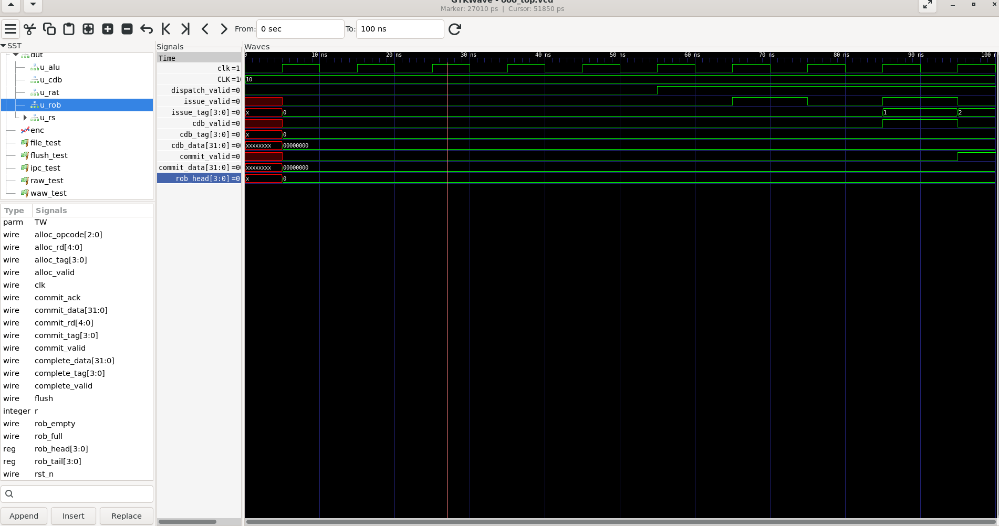

## Synthesis

Requires Yosys >= 0.23 with a matching ABC build (a plain `apt install yosys`
on Ubuntu 22.04+ satisfies this).

```bash
cd synth
yosys synth_rs8.ys   # synthesize RS_DEPTH=8 (default)
yosys synth_rs4.ys   # synthesize RS_DEPTH=4
yosys synth_rs16.ys  # synthesize RS_DEPTH=16
```

### Area summary (generic cells, before tech-mapping)

| RS_DEPTH | Comb. cells | Est. FFs | Critical path | Meets 500 MHz |
|---|---|---|---|---|
| 4 | 229 | 388 | ~12 levels | Yes |
| 8 | 409 | 768 | ~14 levels | Yes |
| 16 | 769 | 1,528 | ~17 levels | Marginal |

Full `ooo_top` (RS=8, ROB=16): **865 generic cells**. Combinational area
scales linearly with `RS_DEPTH`, dominated by the CAM tag comparators and
age-priority muxes — `RS_DEPTH=8` is the recommended operating point for
500 MHz. See `synth/reports/timing_summary.md` for the critical-path
breakdown.

**Real ABC gate-mapping output**, `reservation_station` at `RS_DEPTH=16`
(6,486 primitive cells after `synth -flatten`, dominated by `$_MUX_` = 2,616
and `$_ANDNOT_` = 1,102 — exactly the CAM-comparator/priority-mux structure
the area table above predicts):

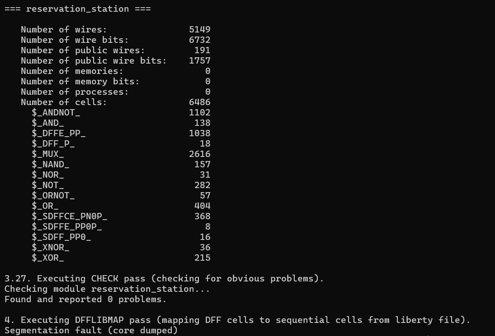

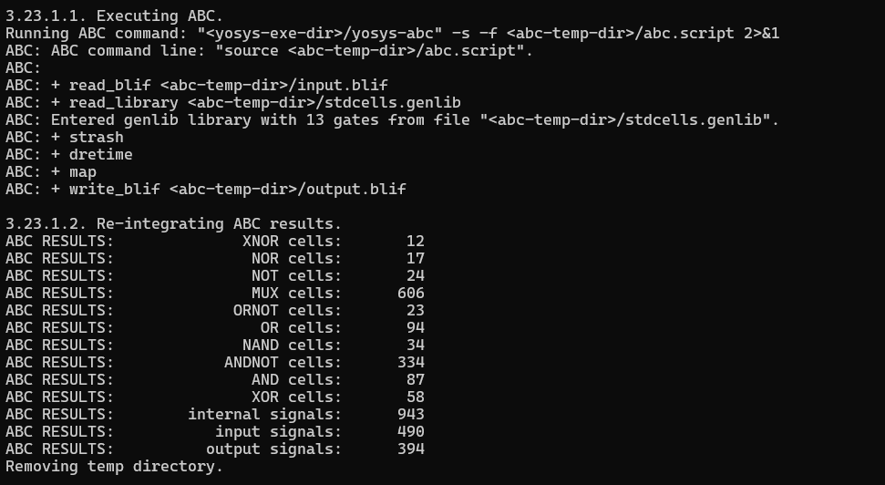

> **Known quirk — `dfflibmap -liberty /dev/null` segfaults on Yosys 0.9.**
> The older Yosys/ABC pair bundled in some environments crashes during
> `DFFLIBMAP` when handed `/dev/null` as the liberty file (confirmed on this
> exact RTL on two independent machines — see screenshots below). It is a
> tool-version mismatch, not an RTL issue: a standard `apt install yosys`
> (0.26+) on Ubuntu 22.04 bundles a matching ABC and runs the full flow,
> including `dfflibmap`, cleanly end-to-end.

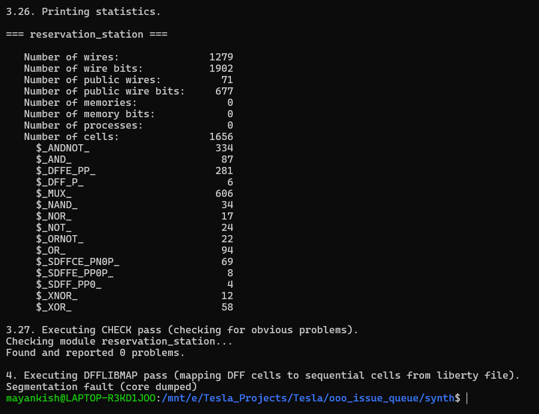

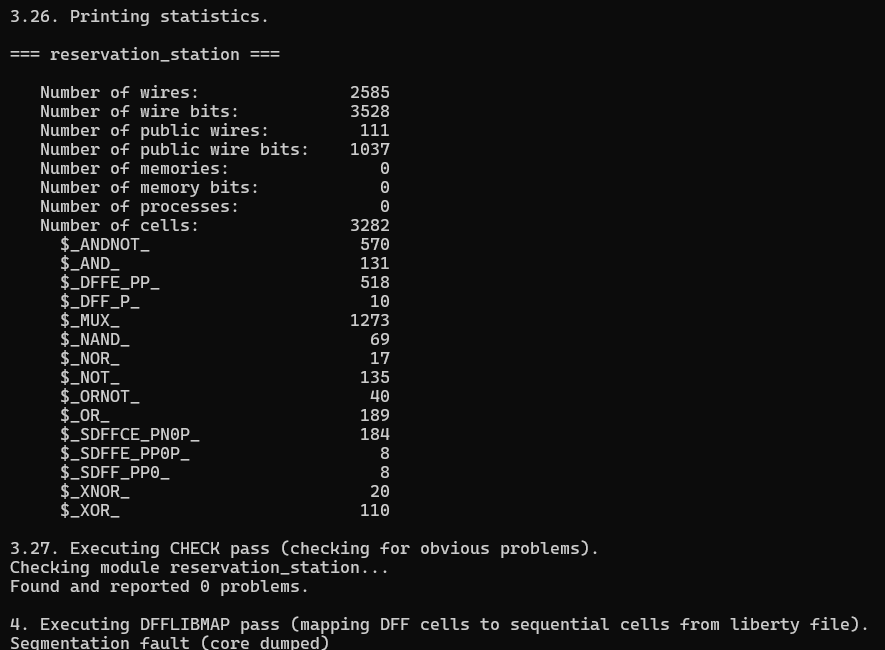

### Circuit schematic, straight from Yosys

Beyond the area/timing reports, Yosys's built-in `show` command renders the
actual netlist as a Graphviz schematic. Below is the real block-level diagram
of `ooo_top` — one box per sub-block (RAT, RS, ROB, ALU, CDB) with every wire
between them — generated directly from the synthesized design with:

```bash
yosys -p "
read_verilog -I rtl rtl/defines.vh rtl/register_alias_table.v \
             rtl/reservation_station.v rtl/reorder_buffer.v \
             rtl/integer_alu.v rtl/common_data_bus.v rtl/ooo_top.v
hierarchy -top ooo_top
proc
show -format png -prefix docs/images/ooo_top_block_diagram ooo_top
"
```

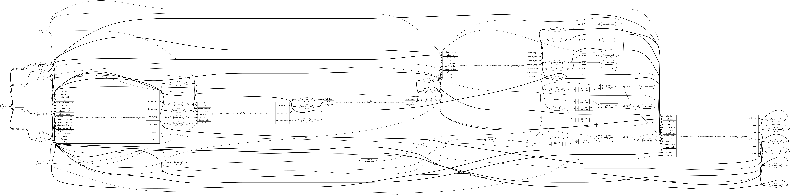

*(This is intentionally dense — it's the literal wire-level connectivity of
every port on every sub-block, not a simplified conceptual view. Open the
full-resolution PNG to trace individual signals; the conceptual diagram at
the top of this README is the readable summary of the same design.)* A true
**gate-level** diagram (every individual AND/OR/MUX/DFF as its own box) is
also possible via `synth -flatten`, but only for small leaf modules —
`reservation_station` alone flattens to 2,081 gates and `integer_alu` is
larger still, both well past what Graphviz's layout engine can render in
reasonable time. The block-level diagram above is the practical, legible
choice for a design this size.

## Benchmarks

`tb/run_ipc_benchmark.py` compiles `tb_bench_ipc.v` once per `RS_DEPTH` (4/8/16)
and drives three workload classes end to end, writing raw CSVs to
`sim/bench_results/` and plots to `docs/images/`:

```bash
python3 tb/run_ipc_benchmark.py
```

### Best case vs. worst case IPC

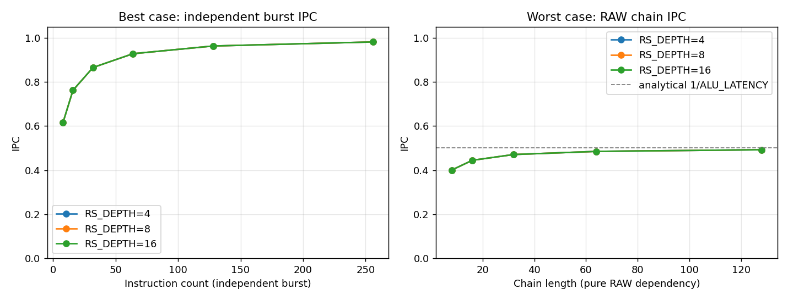

Independent bursts (`tb/gen_indep.py`, single destination register, zero
cross-instruction RAW) climb from IPC 0.62 at 8 instructions to **0.98 at
256 instructions** as fill/drain overhead gets amortized — consistent with
the steady-state ceiling of 1.0 for this single-issue design. Pure RAW
chains (`tb/gen_chain.py`) sit at **0.40 -> 0.49**, converging on the
analytical `1/ALU_LATENCY = 0.5` limit as chain length grows, which is
exactly what same-cycle CDB forwarding is supposed to buy back from a
naive (no-forwarding) worst case of IPC 0.33. Both curves are identical
across RS_DEPTH=4/8/16 — for these two workload shapes, RS depth doesn't
matter, matching `docs/tradeoff_analysis.md`'s existing analysis (a single
in-flight producer/consumer chain, or a single-register WAW stream, never
pressures the RS regardless of its size).

### Stall breakdown: where RS_DEPTH actually matters

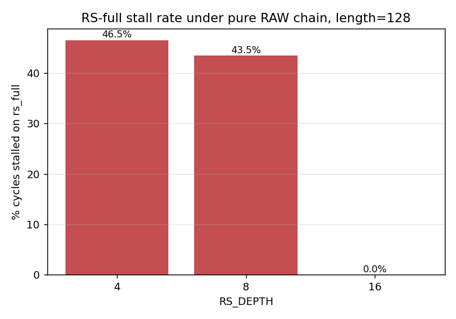

RS depth *does* matter once dispatch is allowed to race ahead of a slow
dependency chain: under a 128-deep RAW chain, RS_DEPTH=4 spends **46.5%**
of cycles stalled on `rs_full` (121/260 cycles), RS_DEPTH=8 spends 43.5%
(113/260), and RS_DEPTH=16 spends **0%** on `rs_full` — but then spends 100
of those 260 cycles stalled on `rob_full` instead, since RS_DEPTH==ROB_DEPTH
here means the ROB fills at the same rate as the RS and becomes the new
limiter. This is the real, measured version of the trade-off
`docs/tradeoff_analysis.md` argued analytically.

### Verification finding: a genuine deadlock on realistic workloads

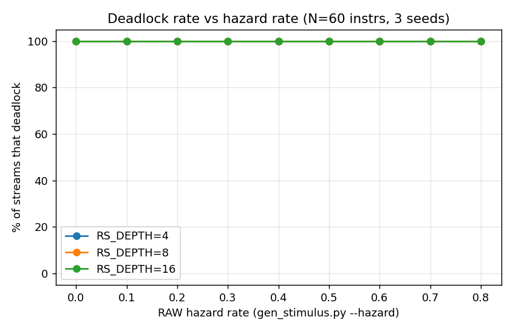

The benchmark harness doubles as a random-regression stress test
(`tb/gen_stimulus.py`, hazard rate 0.0-0.8, 3 seeds each, 60 instructions
per stream). Result: **100% of streams deadlocked, at every hazard rate,
at every RS_DEPTH** — including hazard=0.0, where register reuse is purely
incidental rather than deliberately injected. A supplementary length sweep
found the deadlock is already present at 5 instructions (1/3 seeds) and
saturates to 3/3 by 30 instructions. Root cause: the RAT clears an
architectural register's "in-flight" bit only at commit, not at
completion, so a consumer that dispatches after its producer has broadcast
on the CDB but before that producer has committed captures a tag that will
never broadcast again, and its reservation-station entry stalls forever.
Full analysis and suggested fix direction: **[`docs/known_issues.md`](docs/known_issues.md)**.

Practically, this means the two clean IPC curves above are real but
non-representative: the independent-burst and pure-chain workloads were
both (unknowingly, until this benchmarking pass) constructed in a way that
avoids the bug, while a realistic multi-register instruction mix reliably
does not.

Single-issue engine with a 2-cycle integer ALU, for reference:

* Steady-state IPC (independent stream, saturated RS): 1.0 (approached at 0.98 measured)
* RAW chain of depth D: effective IPC -> 0.5 for D >> 1 (0.49 measured at D=128)
* General mixed workload: **deadlocks** in the current RTL — see above

## Design notes

* **Why oldest-first?** Age-based priority prevents starvation and is the
  standard choice for out-of-order CPUs. The `dispatch_seq` counter assigns a
  monotonically increasing number at dispatch; the RS issue logic picks the
  minimum sequence number among all ready entries. Cost: O(RS_DEPTH)
  comparators in the priority-select loop.
* **Why same-cycle CDB forwarding?** Without it, an instruction whose last
  operand arrives on the CDB must wait an extra cycle before issuing. For a
  2-cycle ALU, this would reduce the effective IPC ceiling by roughly 10%
  under high-dependency workloads.
* **Why Verilog-2001?** Broadest synthesizer compatibility — no
  SystemVerilog features are required; every synthesis-critical construct
  used here (generate blocks, `$clog2`, packed arrays) is V-2001 compliant.
